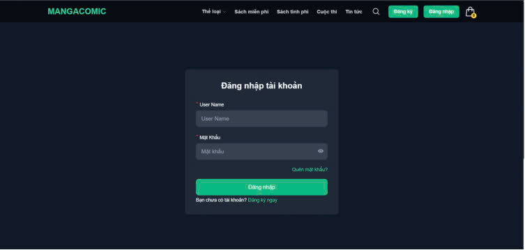
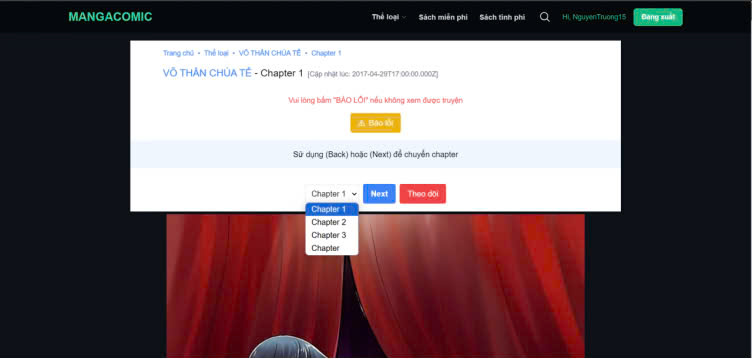

# MangaComic - Online Manga Reading & Bookstore

## 📖 Overview
To meet the demand for reading and owning books anytime, anywhere, the **MangaComic** website was developed as an online platform for reading and purchasing manga books. This website not only allows users to access a rich collection of books quickly and conveniently but also provides tools for book search, personalized recommendations, reading progress tracking, and a seamless online reading experience.

Beyond benefiting individual readers, **MangaComic** serves as a community hub for book lovers to share favorite books and discover new ones. It is an ideal solution for manga enthusiasts who want an easy and convenient way to own their favorite collections.

## 🛠 Technologies Used
### **Frontend**
- ReactJS
- HTML, CSS, JavaScript
- Tailwind CSS

### **Backend**
- Spring Boot
- JWT Authentication

### **Database**
- SQL Server

## 🔥 Key Features

### **General Features**
- User Registration
- Login & Authentication
- Password Recovery
- Book Search
- View Book Details

### **Customer Features**
- Read Books Online
- Rate Books
- Comment on Books
- Purchase Books
- Online Payment
- View Purchase History
- Manage Account Information
- Track Reading History
- Add Books to Favorites
- Manage Shopping Cart
- Participate in Book-related Contests
- Read Blog Posts

### **Admin Features**
- Manage Customer Accounts
- Manage Books & Chapters
- Manage Orders
- Manage Promotions
- Organize Book Contests
- Publish Blog Posts

## 🎨 UI Previews
Here are some screenshots of the website UI:

### **Homepage**


### **Book Details Page**


### **Login Page**


### **Reading Book Page**


### **Admin Page**


## 🚀 Get Started

### **Install Dependencies**
```sh
npm install
```

### **Run Project**
```sh
npm start
```

## 👥 Contributors
- **Nguyễn Đăng Trường**
- **Nguyễn Hữu Tiến**
